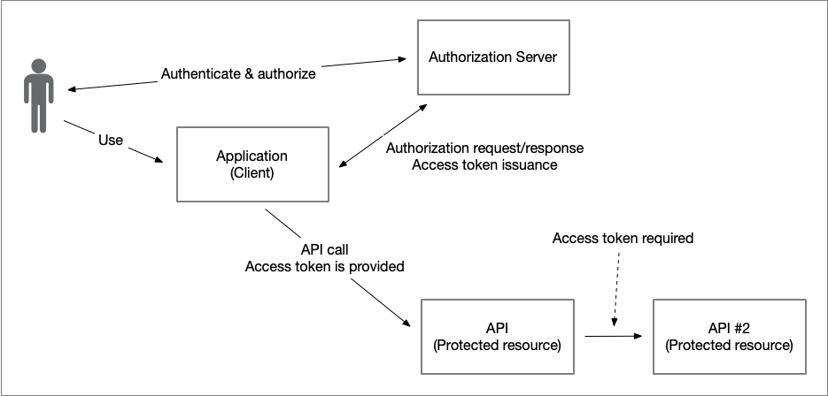

# Ena OAuth 2.0 Token Exchange Profile for Chaining Identity and Authorization

### Version: 1.0 - draft 01 - 2025-09-16

## Abstract

TODO

## Table of Contents

1. [**Introduction**](#introduction)

    1.1. [Requirements Notation and Conventions](#requirements-notation-and-conventions)

2. [**Problem Statements**](#problem-statements)

    2.1. [Protected Resource Acting as an Client](#protected-resource-acting-as-an-client)

    2.2. [Accessing Protected Resources in Other Domains](#accessing-protected-resources-in-other-domains)

8. [**References**](#references)

    8.1. [Normative References](#normative-references)

    8.2. [Informational References](#informational-references)

----
    

## 1. Introduction

TODO

### 1.1. Requirements Notation and Conventions

The keywords “MUST”, “MUST NOT”, “REQUIRED”, “SHALL”, “SHALL NOT”, “SHOULD”, “SHOULD NOT”, “RECOMMENDED”, “MAY”, and “OPTIONAL” are to be interpreted as described in \[[RFC2119](#rfc2119)\].

These keywords are capitalized when used to unambiguously specify requirements over protocol features and behavior that affect the interoperability and security of implementations. When these words are not capitalized, they are meant in their natural-language sense.

## 2. Problem Statements

This section illustrates the problems and challenges that this specification aims to solve.  

Common to both use cases described below is that each API, or protected resource, requires the presentation of a valid access token granted by the resource owner (user). In other words, the access token obtained must involve the user, for example through the authorization code grant.  

**Note:** The problem statements therefore do not include use of the client credentials grant, where one service calls another without the involvement of a user or resource owner. Such usage is not affected by the chaining challenges described below and is therefore out of scope for this specification.  

### 2.1. Protected Resource Acting as an Client

The simple illustration below illustrates a typical use of the OAuth 2.0 authorization code grant, where an application (OAuth 2.0 client) requests an access token to access an API (protected resource). The user (resource owner) grants the request, and the authorization server issues an access token that the application presents when calling the API.

But what happens if the implementation of the API needs to make a backend call to a second API in order to construct a response to the API request?

In this scenario, the first API will act as an OAuth 2.0 client against the second API, but how will it acquire the access token to pass along in the call?

Firstly, let's determine why the access token it received in the call from the application cannot simply be forwarded:

- The audience for this access token is set to be the first API and according to access token processing rules (see Section 6.1 of \[[Ena.OAuth2.Profile](#ena-oauth2-profile)\]) the second API would reject this token since it is not intended for it.

- The `client_id` claim for the access token is set to the identifier of the client making the request which in our case is the application. 

- The scope(s) issued for the first access token may differ from the scope requirements of the second API.

- If the "Demonstrating Proof of Possession - DPoP", \[[RFC9449](#rfc9449)\], security feature is used within the OAuth-deployment, the first API cannot simply forward the DPoP-header to the second API since it is a one-time use header that is also bound to the exact URL of the (orginal) request.

Some deployments that do not use DPoP forward access tokens between services in a call chain. In such cases, the access token either contains multiple audience values or all invoked services are treated as the same entity. Furthermore, the initial client identifier is passed along the chain, which breaks traceability. Entities conformant with this profile MUST NOT rely on such shortcuts.

The following sections specify how OAuth 2.0 Token Exchange, as defined in \[[RFC8693](#rfc8693)\], can be used by a protected resource to obtain a new access token from a previously received one before acting as an OAuth 2.0 client to call another service.

### 2.2. Accessing Protected Resources in Other Domains

The previous section described the challenge of identity and authorization chaining for services within the same domain, i.e., where the same trust model and authorization server are used. However, applications may also need to access resources outside their own domain, where a different authorization server and trust model apply.   

TODO: ...

## X. References

### X.1. Normative References

**\[RFC2119\]**
> [Bradner, S., "Key words for use in RFCs to Indicate Requirement Levels", March 1997](https://www.ietf.org/rfc/rfc2119.txt).

**\[RFC7523\]**
> [Jones, M., Campbell, B., and C. Mortimore, "JSON Web Token (JWT) Profile for OAuth 2.0 Client Authentication and Authorization Grants", RFC 7523, DOI 10.17487/RFC7523, May 2015](https://datatracker.ietf.org/doc/html/rfc7523).

**\[RFC8693\]**
> [Jones, M., Campbell, B., and D. Waite, "OAuth 2.0 Token Exchange", RFC 8693, DOI 10.17487/RFC8693, January 2020](https://www.rfc-editor.org/info/rfc8693).

**\[RFC9449\]**
> [Fett, D., Campbell, B., Bradley, J., Lodderstedt, T., Jones, M., and D. Waite, "OAuth 2.0 Demonstrating Proof of Possession (DPoP)", RFC 9449, DOI 10.17487/RFC9449, September 2023](https://www.rfc-editor.org/info/rfc9449).

**\[Ena.OAuth2.Profile\]**
> [Ena OAuth 2.0 Interoperability Profile](https://github.com/ena-infrastructure/specifications/blob/main/ena-oauth2-profile.md)

### X.2. Informational References

**\[Draft.ID-Chaining\]**
> [Schwenkschuster, A., Kasselmann, P., Burgin, K., Jenkins, M., and B. Campbell, "OAuth Identity and Authorization Chaining Across Domains", draft-ietf-oauth-identity-chaining-06, September 2025](https://www.ietf.org/archive/id/draft-ietf-oauth-identity-chaining-06.html).