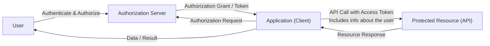
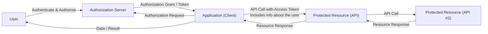

# Ena OAuth 2.0 Token Exchange Profile for Chaining Identity and Authorization

### Version: 1.0 - draft 01 - 2025-09-16

## Abstract

TODO

## Table of Contents

1. [**Introduction**](#introduction)

    1.1. [Requirements Notation and Conventions](#requirements-notation-and-conventions)

2. [**Problem Statements**](#problem-statements)

    2.1. [Protected Resource Acting as an Client](#protected-resource-acting-as-an-client)

    2.2. [Accessing Protected Resources in Other Domains](#accessing-protected-resources-in-other-domains)

8. [**References**](#references)

    8.1. [Normative References](#normative-references)

    8.2. [Informational References](#informational-references)

----
    

## 1. Introduction

TODO

### 1.1. Requirements Notation and Conventions

The keywords “MUST”, “MUST NOT”, “REQUIRED”, “SHALL”, “SHALL NOT”, “SHOULD”, “SHOULD NOT”, “RECOMMENDED”, “MAY”, and “OPTIONAL” are to be interpreted as described in \[[RFC2119](#rfc2119)\].

These keywords are capitalized when used to unambiguously specify requirements over protocol features and behavior that affect the interoperability and security of implementations. When these words are not capitalized, they are meant in their natural-language sense.

## 2. Problem Statements

This section illustrates the problems and challenges that this specification aims to solve in a 

### 2.1. Protected Resource Acting as an Client

The simple flow chart below illustrates a typical use of the OAuth 2.0 authorization code grant where an application (OAuth 2.0 client) requests an access token for accessing an API (protected resource). The user (resource owner) grants this request, and the authorization server issues an access token that the application can supply in the call to the API.

The "Ena OAuth 2.0 Interoperability Profile", \[[Ena.OAuth2.Profile](#ena-oauth2-profile)\], defines the requirements for all the above steps, but what happens if the implementation of the API needs to perform a backend-call to API #2 in order to put together a response for the API-request? 

If API #2 does not have any access token requirements the flow chart above will work, but this would require XXX

If the API #2 requires a valid access token in order to grant access to its service, 

XXX 

### 2.2. Accessing Protected Resources in Other Domains

## X. References

### X.1. Normative References

**\[RFC2119\]**
> [Bradner, S., "Key words for use in RFCs to Indicate Requirement Levels", March 1997](https://www.ietf.org/rfc/rfc2119.txt).

**\[RFC7523\]**
> [Jones, M., Campbell, B., and C. Mortimore, "JSON Web Token (JWT) Profile for OAuth 2.0 Client Authentication and Authorization Grants", RFC 7523, DOI 10.17487/RFC7523, May 2015](https://datatracker.ietf.org/doc/html/rfc7523).

**\[RFC8693\]**
> [Jones, M., Campbell, B., and D. Waite, "OAuth 2.0 Token Exchange", RFC 8693, DOI 10.17487/RFC8693, January 2020](https://www.rfc-editor.org/info/rfc8693).

**\[Ena.OAuth2.Profile\]**
> [Ena OAuth 2.0 Interoperability Profile](https://github.com/ena-infrastructure/specifications/blob/main/ena-oauth2-profile.md)

### X.2. Informational References

**\[Draft.ID-Chaining\]**
> [Schwenkschuster, A., Kasselmann, P., Burgin, K., Jenkins, M., and B. Campbell, "OAuth Identity and Authorization Chaining Across Domains", draft-ietf-oauth-identity-chaining-06, September 2025](https://www.ietf.org/archive/id/draft-ietf-oauth-identity-chaining-06.html).