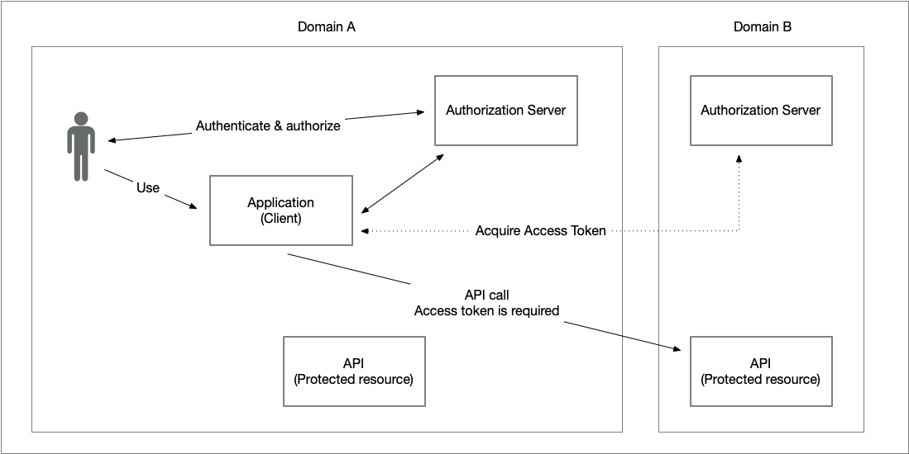
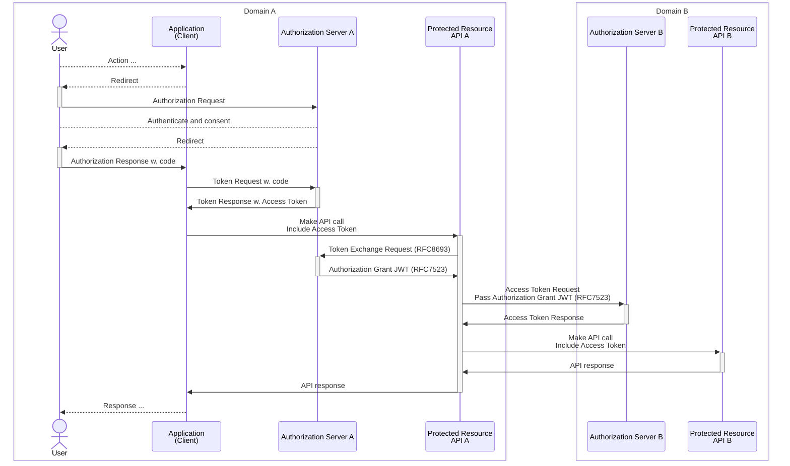

# Ena OAuth 2.0 Token Exchange Profile for Chaining Identity and Authorization

### Version: 1.0 - draft 01 - 2025-09-23

## Abstract

The OAuth 2.0 framework defines mechanisms that allow users (resource owners) to delegate access rights to protected resources for the applications they use.

This document specifies solutions for chaining OAuth 2.0 identity and authorization in scenarios where calls to protected resources trigger additional calls, or where calls cross domain boundaries.

## Table of Contents

1. [**Introduction**](#introduction)

    1.1. [Requirements Notation and Conventions](#requirements-notation-and-conventions)

2. [**Protected Resource Acting as an Client**](#protected-resource-acting-as-an-client)

    2.1. [Problem Statement](#2-1-problem-statement)
    
    2.2. [Solution Overview](#2-2-solution-overview)

    2.3. [Token Exchange Request](#2-3-token-exchange-request)

    2.3.1. [Processing Requirements](#2-3-1-processing-requirements)

    2.4. [Token Exchange Response](#2-4-token-exchange-response)

    2.4.1. [The Actor Claim](#the-actor-claim)

    2.5. [Examples](#2-5-examples)

3. [**Accessing Protected Resources in Other Domains**](#accessing-protected-resources-in-other-domains)

    3.1. [Problem Statement](#3-1-problem-statement)

    3.2. [Solution Overview](#3-2-solution-overview)
    
    3.2.1. [Domain Trust Relationships and Prerequisites](#domain-trust-relationships-and-prerequisites)

    3.3. [Token Exchange](#3-3-token-exchange)

    3.3.1. [Token Exchange Request](#3-3-1-token-exchange-request)

    3.3.2. [Inbound Token Requirements](#3-3-2-inbound-token-requirements)

    3.3.3. [Processing Requirements](#3-3-3-processing-requirements)

    3.3.4. [Token Exchange Response and JWT Contents](#token-exchange-response-and-jwt-contents)

    3.4. [Authorization Grant Requirements](#authorization-grant-requirements)

    3.4.1. [Access Token Request According to RFC7523](#access-token-request-according-to-rfc7523)

    3.4.2. [Processing of JWT Authorization Grant](#processing-of-jwt-authorization-grant)

    3.4.3. [Requirements for Issued Access Token](#requirements-for-issued-access-token)
    
    3.5. [Additional Features](#additional-features)

    3.5. [Additional Features and Advanced Topics](#additional-features-and-advanced-topics)

    3.6. [Examples](#3-6-examples)

4. [**References**](#references)

    4.1. [Normative References](#normative-references)

    4.2. [Informational References](#informational-references)


----
    
<a name="introduction"></a>
## 1. Introduction

The "OAuth 2.0 Token Exchange" specification, \[[RFC8693](#rfc8693)\], defines a generic extension to OAuth 2.0 that allows an entity to call an OAuth 2.0 authorization server acting as a Security Token Service (STS) in order to exchange a token in its possession for another token. While token exchange is a powerful tool for addressing many OAuth 2.0-related challenges, a generic specification such as \[[RFC8693](#rfc8693)\] requires profiling to achieve interoperability and to avoid introducing security risks.

This specification profiles the use of OAuth 2.0 Token Exchange for two common use cases where a structured and secure method of applying OAuth 2.0 has not previously been defined.  

- [Protected Resource Acting as a Client](#protected-resource-acting-as-a-client) &ndash; A protected resource may, in order to fulfil a request, need to act as an OAuth 2.0 client and make another call that requires an access token. This use case is described in [Section 2](#protected-resource-acting-as-a-client).  

- [Accessing Protected Resources in Other Domains](#accessing-protected-resources-in-other-domains) &ndash; Entities may need to access resources outside their own domain, where a different authorization server and trust model apply, and in many cases, a different user authentication model is used. This use case is described in [Section 3](#accessing-protected-resources-in-other-domains).  

Common to both use cases is that each API, or protected resource, requires the presentation of a valid access token granted by the resource owner (user). In other words, the access token obtained must involve the user, for example through the authorization code grant, and it must carry the user’s identity so that this identity can be chained across subsequent calls.  

**Note:** The problem statements therefore do not include the use of the client credentials grant, where one service calls another without the involvement of a user or resource owner. Such usage is not affected by the chaining challenges described in this document and is therefore out of scope for this specification.  

<a name="requirements-notation-and-conventions"></a>
### 1.1. Requirements Notation and Conventions

The keywords “MUST”, “MUST NOT”, “REQUIRED”, “SHALL”, “SHALL NOT”, “SHOULD”, “SHOULD NOT”, “RECOMMENDED”, “MAY”, and “OPTIONAL” are to be interpreted as described in \[[RFC2119](#rfc2119)\].

These keywords are capitalized when used to unambiguously specify requirements over protocol features and behavior that affect the interoperability and security of implementations. When these words are not capitalized, they are meant in their natural-language sense.

<a name="protected-resource-acting-as-an-client"></a>
## 2. Protected Resource Acting as an Client

<a name="2-1-problem-statement"></a>
### 2.1. Problem Statement

The simple illustration below illustrates a typical use of the OAuth 2.0 authorization code grant, where an application (OAuth 2.0 client) requests an access token to access an API (protected resource). The user (resource owner) grants the request, and the authorization server issues an access token that the application presents when calling the API.

But what happens if the implementation of the API needs to make a backend call to a second API in order to construct a response to the API request?


In this scenario, the first API will act as an OAuth 2.0 client against the second API, but how will it acquire the access token to pass along in the call?

Firstly, let's determine why the access token it received in the call from the application cannot simply be forwarded:

- The audience for this access token is set to be the first API and according to access token processing rules (see Section 6.1 of \[[Ena.OAuth2.Profile](#ena-oauth2-profile)\]) the second API would reject this token since it is not intended for it.

- The `client_id` claim for the access token is set to the identifier of the client making the request which in our case is the application. 

- The scope(s) issued for the first access token may differ from the scope requirements of the second API.

- If the "Demonstrating Proof of Possession - DPoP", \[[RFC9449](#rfc9449)\], security feature is used within the OAuth-deployment, the first API cannot simply forward the DPoP-header to the second API since it is a one-time use header that is also bound to the exact URL of the (orginal) request.

Some deployments that do not use DPoP forward access tokens between services in a call chain. In such cases, the access token either contains multiple audience values or all invoked services are treated as the same entity. Furthermore, the initial client identifier is passed along the chain, which breaks traceability. Entities conformant with this profile MUST NOT rely on such shortcuts.

The following sub-sections specify how OAuth 2.0 Token Exchange, as defined in \[[RFC8693](#rfc8693)\], can be used by a protected resource to obtain a new access token based on a previously received one before acting as an OAuth 2.0 client to call another service.

<a name="2-2-solution-overview"></a>
### 2.2. Solution Overview

The sequence diagram below illustrates the role of OAuth 2.0 Token Exchange during chained API-calls. 


Steps 1 through 9 represents an ordinary OAuth 2.0 authorization code flow, where the application (client) obtains an access token by directing the user to the authorization server where the user delegates rights to the application. The application then uses the issued access token to access the protected resource API A. The protected resource, API A, validates the supplied access token before starting processing of the request.

However, in order for API A to process the API-call and to put together a response, it needs to make a call to an underlying resource, API B.

In order to obtain a valid access token for API B, API A acts as an OAuth 2.0 client towards the authorization server. Instead of prompting the user again or forwarding the original token, API A uses OAuth 2.0 Token Exchange \[[RFC8693](#rfc8693)\] to present the inbound access token it received from the application and requests a new access token intended for API B (steps 10 and 11).  

This mechanism ensures that:  

- The user’s identity and authorization context are preserved across the chained call.  
- The newly issued access token has the correct audience, namely API B, and the appropriate scopes required for the operation.  
- API A’s client identity is visible in the transaction, providing accountability and auditability.  
- Security features such as DPoP bindings remain valid, since the access token is freshly minted for the target resource.  

By using token exchange, API A does not need to manage or impersonate the original client. Instead, it formally assumes the role of an OAuth 2.0 client, bound by the same rules as any other client when requesting access tokens. This maintains a clear separation of concerns: the application acts as a client in relation to API A, and API A acts as a client in relation to API B.

This solution also strengthens traceability, since the resulting access token clearly reflects both the identity of the user (as chained from the inbound token) and the identity of API A as the requesting client. Downstream services can therefore distinguish whether a request originates directly from the user’s application or from another protected resource acting on behalf of the user.  

In the following sections, the exact requirements for the token exchange request, processing rules, and response are defined.

<a name="2-3-token-exchange-request"></a>
### 2.3. Token Exchange Request

A protected resource that needs to act as a client in order to call another protected resource MUST perform an OAuth 2.0 token exchange request in accordance with \[[RFC8693](#rfc8693)\]. The inbound access token received from the original client MUST be supplied as the `subject_token`.

The token exchange request MUST include:

- `grant_type` with the value `urn:ietf:params:oauth:grant-type:token-exchange`.
- `subject_token` containing the inbound access token.
- `subject_token_type` with the value `urn:ietf:params:oauth:token-type:access_token`.
- A target indicator: either
  - `resource` (as defined by \[[RFC8707](#rfc8707)\]) identifying the downstream protected resource, or
  - `audience` (as defined by \[[RFC8693](#rfc8693)\]) identifying the downstream protected resource.

Clients SHOULD include:

- `requested_token_type` with the value `urn:ietf:params:oauth:token-type:access_token`.

Clients MAY include:

- `scope` if specific scopes are required by the downstream protected resource. Any requested scopes MUST have been consented to by the user in the original authorization and MUST NOT exceed what was directly or indirectly authorized.

Unless overridden by local policy, the target indicator (`resource` or `audience`) MUST be the Resource Identifier of the target (protected resource). See Sections 4.3 and 7.1 of \[[Ena.OAuth2.Profile](#ena-oauth2-profile)\].

Multiple `resource` or `audience` parameters MAY be included to indicate the intended use of the resulting access token at multiple protected resources, or as stated in Section 6.1.1 of \[[Ena.OAuth2.Profile](#ena-oauth2-profile)\], to support alternative representations of a protected resource as audience values.

Client authentication at the token endpoint MUST follow the requirements given in \[[Ena.OAuth2.Profile](#ena-oauth2-profile)\].

<a name="2-3-1-processing-requirements"></a>
#### 2.3.1. Processing Requirements

When processing a token exchange request, the authorization server MUST:

- Validate the inbound access token as if it were presented directly to a protected resource (including expiry, revocation, audience, and signature validation).
- Ensure the inbound access token:
  - Was issued by the same authorization server.
  - Contains a `sub` claim identifying the end-user.
  - Contains a `client_id` claim identifying the original client application.
  - Has the requesting entity as its intended audience.
- Reject the request if the inbound access token was obtained through the client credentials grant, since such tokens lack user identity and cannot support identity chaining.
- Verify that the requesting entity is authorized to perform token exchange.
- Enforce that at least one target indicator (`resource` or `audience`) is present.
  - If neither is present, the request MUST be rejected with `invalid_request`.
  - If multiple values are present, the authorization server MUST process them according to local policy and the requirements in \[[Ena.OAuth2.Profile](#ena-oauth2-profile)\] (for example, supporting multiple audiences or alternative identifiers for the same resource as described in Section 6.1.1).
- Verify that each requested target corresponds to a registered downstream protected resource.
- Verify that any requested `scope` is consistent with what was originally authorized by the user. Scopes that have not been directly or indirectly consented to MUST be rejected.
- If `requested_token_type` is omitted, issue an access token.
- If `requested_token_type` is present with any other value than `urn:ietf:params:oauth:token-type:access_token`, reject the request with `invalid_request`.

<a name="2-4-token-exchange-response"></a>
### 2.4. Token Exchange Response

Upon successful validation, the authorization server MUST issue a new access token in response to the token exchange request. The issued access token MUST follow the requirements stated in Section 6.1 of \[[Ena.OAuth2.Profile](#ena-oauth2-profile)\] with the following extensions and clarifications:

- The access token JWT MUST include an `aud` (audience) claim corresponding to the requested downstream protected resource (expressed with the `resource` or `audience` request parameter).
  - The authorization server MAY include additional audience values representing the same resource, for example to support legacy deployments or alternative identifiers not aligned with the entity naming specified in \[[Ena.OAuth2.Profile](#ena-oauth2-profile)\].

- The access token JWT MUST carry the same `sub` (end-user identity) as the inbound access token, thereby preserving the delegated user authorization.

- The access token JWT MUST include all user identity claims from the inbound access token that the receiving entity is authorized to receive.

  - The authorization server MUST NOT include any user identity claims that the receiving entity is not authorized to receive.
  
- If the inbound access token contains claims that provide information about the user’s authentication context, such as `acr`, `amr`, or `auth_time`, these claims MUST be preserved and included in the issued access token JWT.

- In order to provide accountability and auditability, the `act` claim SHOULD be included, containing both the current actor (the entity that requested the access token) and the originating actor(s). The actor MUST be represented using the `sub` claim, consistent with \[[RFC8693](#rfc8693)\]. See [Section 2.4.1](#the-actor-claim) below.

- The access token JWT MUST contain only those scopes that are permitted for the requesting protected resource and relevant to the downstream protected resource. Requested scopes MUST NOT exceed what was originally authorized by the user.

- The access token MUST be bound to proof-of-possession mechanisms (such as \[[RFC9449](#rfc9449)\] DPoP) if such mechanisms are in use in the deployment.

The response MUST be encoded as JSON according to Section 2.2.1 of \[[RFC8693](#rfc8693)\] and include at least the following elements:

- `access_token` – The issued access token as defined above.

- `issued_token_type` – The token type MUST be set to `urn:ietf:params:oauth:token-type:access_token`.

- `token_type` – Specifies the method of using the issued access token. MUST be set to `Bearer`.

- `expires_in` – The validity of the issued access token. The value is dependent on deployment policy and out of scope for this profile.

Furthermore, the `scope` parameter is optional according to \[[RFC8693](#rfc8693)\] if the scope(s) issued were the same as the requested scope(s). However, for simplicity and to improve interoperability, for entities compliant with this profile its use is RECOMMENDED in all cases.

Unless overridden by local policy, authorization servers compliant with this profile MUST NOT issue refresh tokens for token exchange in the context of identity and authorization chaining.

<a name="the-actor-claim"></a>
#### 2.4.1. The Actor Claim

The `act` (actor) claim provides accountability and auditability by recording which entity performed the token exchange. This claim enables downstream protected resources to distinguish between the end-user identity (`sub`) and the chain of actors that acted on behalf of the user.

As defined in Section 4.1 of \[[RFC8693](#rfc8693)\], the `act` claim may be a nested structure to represent multiple actors. Under this profile:

- The authorization server SHOULD include the `act` claim in access tokens issued through token exchange.

- If included, the `act` claim MUST contain a `sub` claim identifying the entity that requested the token exchange.

- The first `sub` claim under the `act` claim will always be identical to the `client_id` claim included in the access token, as required by Section 6.1 of \[[Ena.OAuth2.Profile](#ena-oauth2-profile)\].

- When multiple exchanges occur, the authorization server MUST preserve all previous actors by nesting them according to \[[RFC8693](#rfc8693)\].

- The resulting `act` chain MUST begin with the original client application and continue with each intermediate protected resource that performed a token exchange.

- Consistent with \[[RFC8693](#rfc8693)\], the contents of the `act` claim MUST NOT be used for authorization decisions. It is only intended for accountability, auditability, and traceability.

**Example**

Below is a simplified JWT payload of an access token issued by `https://as.example.com` to be used at `https://api2.example.com`.

```json
{
  "iss": "https://as.example.com",
  "aud": "https://api2.example.com",
  "sub": "user-1234",
  "acr": "http://id.elegnamnden.se/loa/1.0/loa3",
  "client_id": "https://api1.example.com",
  "act": {
    "sub": "https://api1.example.com",
    "act": {
      "sub": "https://app.example.com"
    }
  },
  "scope": "api-read",
  "jti": "987ui87665456",
  "nbf": 1695379200,
  "iat": 1695379200,
  "exp": 1695382800
}
```

In this example:

- The `sub` claim identifies the end-user (user-1234) and the `acr` claim tells under which authentication context class the user was authenticated.
- The `client_id` claim identifies `https://api1.example.com`, the protected resource acting as a client in the token exchange.
- The first `sub` claim under the `act` claim is also `https://api1.example.com`, and therefore always equals the `client_id`.
- The nested `sub` claim under the `act` claim identifies `https://app.example.com`, the original client application.
- The `aud` claim identifies `https://api2.example.com`, the downstream protected resource.

This chaining ensures that all involved actors are visible to the downstream service, while authorization decisions remain based only on the standard claims (`sub`, `aud`, `scope`, etc.).

<a name="2-5-examples"></a>
### 2.5. Examples

This section provides a non-normative, end-to-end illustration of token exchange, aligned with the "Ena OAuth 2.0 Interoperability Profile", \[[Ena.OAuth2.Profile](#ena-oauth2-profile)\].

The example illustrates:

- The inbound access token (JWT) from the application, `https://app.example.com`, to the first protected resource, `https://api1.example.com`.

- The full HTTP token exchange request that the first protected resource, `https://api1.example.com`, sends to the authorization server, `https://as.example.com/token` (including a signed `client_assertion`).


- The HTTP response, and the newly issued access token (JWT) for the second protected resource, `https://api2.example.com`. 

For readability, long values are folded and signatures are abbreviated. All examples use the scope `api-read`.

**Inbound Access Token (JWT):**

Access token presented by the application (`https://app.example.com`) to the first protected resource (`https://api1.example.com`):

```json
{
  "iss": "https://as.example.com",
  "aud": "https://api1.example.com",
  "sub": "user-1234",
  "acr": "http://id.elegnamnden.se/loa/1.0/loa3",
  "client_id": "https://app.example.com",
  "scope": "api-read",
  "jti": "inbound-1234-unique-jwt-id",
  "nbf": 1695375550,
  "iat": 1695375600,
  "exp": 1695379200
}
```

**Token Exchange Request:**

The protected resource `https://api1.example.com` acts as an OAuth 2.0 client and calls the AS token endpoint for a token exchange request, authenticating with `private_key_jwt`. The inbound access token above is supplied as the `subject_token` and a new access token is requested for the audience `https://api2.example.com`.

HTTP request:

```
POST /token HTTP/1.1
Host: as.example.com
Content-Type: application/x-www-form-urlencoded

grant_type=urn%3Aietf%3Aparams%3Aoauth%3Agrant-type%3Atoken-exchange&
subject_token=eyJhbGciOiJSUzI1NiIsInR5cCI6IkpXVCJ9.eyJpc3MiOiJodHRwczovL2FzLmV4YW1wbGUu \
  Y29tIiwiYXVkIjoiaHR0cHM6Ly9hcGkxLmV4YW1wbGUuY29tIiwic3ViIjoidXNlci0xMjM0IiwiY2xpZW50X \
  2lkIjoiaHR0cHM6Ly9hcHAuZXhhbXBsZS5jb20iLCJzY29wZSI6ImFwaS1yZWFkIiwianRpIjoiaW5ib3VuZC \
  0xMjM0LXVuaXF1ZS1qd3QtaWQiLCJuYmYiOjE2OTUzNzU1NTAsImlhdCI6MTY5NTM3NTYwMCwiZXhwIjoxNjk \
  1Mzc5MjAwfQ.MEUCIQDt...&
subject_token_type=urn%3Aietf%3Aparams%3Aoauth%3Atoken-type%3Aaccess_token&
audience=https%3A%2F%2Fapi2.example.com&
scope=api-read&
client_id=https%3A%2F%2Fapi1.example.com&
client_assertion_type=urn%3Aietf%3Aparams%3Aoauth%3Aclient-assertion-type%3Ajwt-bearer&
client_assertion=eyJhbGciOiJSUzI1NiIsImtpZCI6ImtpZC0wMDEiLCJ0eXAiOiJKV1QifQ.eyJpc3MiOiJ \
  odHRwczovL2FwaTEuZXhhbXBsZS5jb20iLCJzdWIiOiJodHRwczovL2FwaTEuZXhhbXBsZS5jb20iLCJhdWQi \
  OiJodHRwczovL2FzLmV4YW1wbGUuY29tL3Rva2VuIiwianRpIjoiYTMtMTIzNC11bmlxdWUtand0LWlkIiwib \
  mJmIjoxNjk1Mzc1NTUwLCJpYXQiOjE2OTUzNzU2MDAsImV4cCI6MTY5NTM3NTkwMH0.MIIB...
```

For reference, the decoded `client_assertion` (`private_key_jwt`) components:

JOSE header:

```json
{
  "alg": "RS256",
  "kid": "kid-001",
  "typ": "client-authentication+jwt"
}
```

JWT claims:

```json
{
  "iss": "https://api1.example.com",
  "sub": "https://api1.example.com",
  "aud": "https://as.example.com",
  "jti": "a3-1234-unique-jwt-id",
  "nbf": 1695375550,
  "iat": 1695375600,
  "exp": 1695375900
}
```

**Token Exchange Response:**

HTTP response:

```
HTTP/1.1 200 OK
Content-Type: application/json
Cache-Control: no-store
Pragma: no-cache

{
  "access_token": "eyJhbGciOiJSUzI1NiIsImtpZCI6ImtpZC0wMDEiLCJ0eXAiOiJKV1QifQ.eyJpc3MiOiJodH \
  RwczovL2FzLmV4YW1wbGUuY29tIiwiYXVkIjoiaHR0cHM6Ly9hcGkyLmV4YW1wbGUuY29tIiwic3ViIjoidXNlci0x \
  MjM0IiwiYWN0Ijp7InN1YiI6Imh0dHBzOi8vYXBpMS5leGFtcGxlLmNvbSIsImFjdCI6eyJzdWIiOiJodHRwczovL2 \
  FwcC5leGFtcGxlLmNvbSJ9fSwic2NvcGUiOiJhcGktcmVhZCIsImp0aSI6Im5ldy0xMjM0LXVuaXF1ZS1qd3QtaWQi \
  LCJuYmYiOjE2OTUzNzkyMDAsImlhdCI6MTY5NTM3OTIwMCwiZXhwIjoxNjk1MzgyODAwfQ.Fh0B...",
  "issued_token_type": "urn:ietf:params:oauth:token-type:access_token",
  "token_type": "Bearer",
  "expires_in": 3600,
  "scope": "api-read"
}
```

**Newly Issued Access Token (JWT):**

Decoded claims of the issued access token intended for `https://api2.example.com`:

```json
{
  "iss": "https://as.example.com",
  "aud": "https://api2.example.com",
  "sub": "user-1234",
  "acr": "http://id.elegnamnden.se/loa/1.0/loa3",
  "client_id": "https://api1.example.com",
  "act": {
    "sub": "https://api1.example.com",
    "act": {
      "sub": "https://app.example.com"
    }
  },
  "scope": "api-read",
  "jti": "new-1234-unique-jwt-id",
  "nbf": 1695379200,
  "iat": 1695379200,
  "exp": 1695382800
}
```

<a name="accessing-protected-resources-in-other-domains"></a>
## 3. Accessing Protected Resources in Other Domains

<a name="3-1-problem-statement"></a>
### 3.1. Problem Statement

The previous section described the challenge of identity and authorization chaining for services within the same domain, i.e., where the same trust model and authorization server are used. However, applications may also need to access resources outside their own domain, where a different authorization server and trust model apply, and in many cases, a different user authentication model.



Given this problem statement, the main challenges are:

- The user cannot simply be redirected to the authorization server in the second domain, since that server has no way of authenticating the user.  
- An access token issued by the authorization server in the first domain will not be accepted by protected resources in the second domain.

The solution to the above challenges requires establishing a trust relationship between the authorization servers in the respective domains. This trust enables the authorization server in the first domain to issue a statement intended for the authorization server in the second domain, allowing clients in the first domain to obtain access tokens that can be used in the second domain.

<a name="3-2-solution-overview"></a>
### 3.2. Solution Overview

> Note: The draft "OAuth Identity and Authorization Chaining Across Domains", \[[Draft.ID-Chaining](#draft-id-chaining)\], focuses on solving the problem described above. Future versions of this profile will reference this specification if and when it reaches RFC status. Until then, the draft is informational and no references will be made to it.

The solution for identity and authorization chaining within the same trust domain involves exchanging an access token for another access token containing the correct audience and scope values. However, when a call is made to another trust domain, the output from the token exchange cannot be an access token usable at the intended protected resource. This is because:

- The authorization server in the originating domain does not have knowledge of protected resources in the target domain with respect to authorization decisions, and  
- a protected resource in the target domain cannot verify an access token issued by an authorization server in another trust domain.

Therefore, token exchange in these cases must use an intermediate proof issued by the authorization server in the originating domain and trusted by the authorization server in the target domain. This proof is represented as a signed JWT in which the authorization server in the originating domain asserts relevant claims about the sending client and delegating user.

For this to function, a trust relationship must be configured between the authorization servers in the two domains; see [Section 3.2.1](#domain-trust-relationships-and-prerequisites) below.


The sequence diagram above describes a token exchange operation that enables an application in domain A to invoke a protected resource in domain B.

1. The user is assumed to be logged in to the application in domain A. How this login was performed is out of scope for this profile.

2. For this illustration, it is assumed that the end-user has a relationship with the authorization server, that is, at some point the user was directed to the authorization server and delegated rights to the application to access a protected resource.

3. The user performs an action in the application that requires the application to access a resource in domain B.

4. To obtain a signed attestation from the authorization server in domain A, which can then be used to request an access token for domain B, the application makes an OAuth 2.0 token exchange request to the authorization server. Included in this request is a previously acquired access or refresh token. See [Section 3.3.1](#3-3-1-token-exchange-request) and [Section 3.3.2](#3-3-2-inbound-token-requirements).

5. Based on its configuration and established trust relationships, the authorization server in domain A returns a signed JWT. This JWT contains claims attesting to the information needed by the authorization server in domain B to issue an access token. See [Section 3.3.4](#token-exchange-response-and-jwt-contents).

6. The application (client) in domain A then uses the received JWT authorization grant in a token request to the authorization server in domain B. This is done according to the authorization grant processing requirements defined in \[[RFC7523](#rfc7523)\]. See [Section 3.4.1](#access-token-request-according-to-rfc7523).

7. The authorization server in domain B processes the request according to [Section 3.4.2](#processing-of-jwt-authorization-grant) and issues an access token that can be used to access the protected resource in domain B. See [Section 3.4.3](#requirements-for-issued-access-token).

Steps 8–10 follow normal OAuth 2.0 access token usage: the client provides the access token in the request to the protected resource, which validates it before granting access and returning a response.

The cross-domain use case can also be combined with the previous use case, where a protected resource in domain A acts as an OAuth 2.0 client towards domain B. This is illustrated in the sequence diagram below. The requirements in the following sections also cover these usages of token exchange.



<a name="domain-trust-relationships-and-prerequisites"></a>
#### 3.2.1. Domain Trust Relationships and Prerequisites

For the above token exchange flows to be possible, there must be a trust relationship configured in which the authorization server in the target domain accepts authorization grant JWTs issued by the authorization server in the originating domain. In addition, all entities in the originating domain that make cross-domain calls must be registered as OAuth 2.0 clients at the authorization server in the target domain.

How these relationships are established, and the requirements for trust, are out of scope for this specification.

However, the minimum requirements for establishing the cross-domain use case are as follows:

- The key used by the authorization server in the originating domain MUST be known to the authorization server in the target domain.

- The issuer identifier for the authorization server in the originating domain MUST be known to the authorization server in the target domain and tied to the corresponding key.

- All entities in the originating domain that may act as clients towards the target domain MUST be registered at the authorization server in the target domain.

    - How this registration is performed is out of scope for this specification. It may be done out of band via manual procedures, or through automatic client registration using OpenID Federation.
    
    - An OAuth 2.0 entity in the originating domain MAY be named or identified differently in the target domain. In such cases, the authorization server in the originating domain MUST be aware of both identities when issuing the authorization grant JWT.

Also, there is no guarantee that the scopes used in the target domain have any meaning in the originating domain. Therefore, the authorization servers may need to maintain mappings of scopes and other rights, and define how to apply these control mechanisms when managing authorization across domain boundaries. See [Section 3.5](#additional-features-and-advanced-topics) below.

<a name="3-3-token-exchange"></a>
### 3.3. Token Exchange

<a name="3-3-1-token-exchange-request"></a>
#### 3.3.1. Token Exchange Request

<a name="3-3-2-inbound-token-requirements"></a>
#### 3.3.2. Inbound Token Requirements

<a name="3-3-3-processing-requirements"></a>
#### 3.3.3. Processing Requirements

<a name="token-exchange-response-and-jwt-contents"></a>
#### 3.3.4. Token Exchange Response and JWT Contents

<a name="authorization-grant-requirements"></a>
### 3.4. Authorization Grant Requirements

<a name="access-token-request-according-to-rfc7523"></a>
#### 3.4.1. Access Token Request According to RFC7523

<a name="processing-of-jwt-authorization-grant"></a>
#### 3.4.2. Processing of JWT Authorization Grant

<a name="requirements-for-issued-access-token"></a>
#### 3.4.3. Requirements for Issued Access Token

<a name="additional-features-and-advanced-topics"></a>
### 3.5. Additional Features and Advanced Topics

<a name="3-6-examples"></a>
### 3.6. Examples

<a name="references"></a>
## 4. References

<a name="normative-references"></a>
### 4.1. Normative References

<a name="rfc2119"></a>
**\[RFC2119\]**
> [Bradner, S., "Key words for use in RFCs to Indicate Requirement Levels", March 1997](https://www.ietf.org/rfc/rfc2119.txt).

<a name="rfc7523"></a>
**\[RFC7523\]**
> [Jones, M., Campbell, B., and C. Mortimore, "JSON Web Token (JWT) Profile for OAuth 2.0 Client Authentication and Authorization Grants", RFC 7523, DOI 10.17487/RFC7523, May 2015](https://datatracker.ietf.org/doc/html/rfc7523).

<a name="rfc8693"></a>
**\[RFC8693\]**
> [Jones, M., Campbell, B., and D. Waite, "OAuth 2.0 Token Exchange", RFC 8693, DOI 10.17487/RFC8693, January 2020](https://www.rfc-editor.org/info/rfc8693).

<a name="rfc8707"></a>
**\[RFC8707\]**
> [Campbell, B., Bradley, J., and H. Tschofenig, "Resource Indicators for OAuth 2.0", RFC 8707, DOI 10.17487/RFC8707, February 2020](https://datatracker.ietf.org/doc/html/rfc8707).

<a name="rfc9449"></a>
**\[RFC9449\]**
> [Fett, D., Campbell, B., Bradley, J., Lodderstedt, T., Jones, M., and D. Waite, "OAuth 2.0 Demonstrating Proof of Possession (DPoP)", RFC 9449, DOI 10.17487/RFC9449, September 2023](https://www.rfc-editor.org/info/rfc9449).

<a name="ena-oauth2-profile"></a>
**\[Ena.OAuth2.Profile\]**
> [Ena OAuth 2.0 Interoperability Profile](https://github.com/ena-infrastructure/specifications/blob/main/ena-oauth2-profile.md)

<a name="informational-references"></a>
### 4.2. Informational References

<a name="draft-id-chaining"></a>
**\[Draft.ID-Chaining\]**
> [Schwenkschuster, A., Kasselmann, P., Burgin, K., Jenkins, M., and B. Campbell, "OAuth Identity and Authorization Chaining Across Domains", draft-ietf-oauth-identity-chaining-06, September 2025](https://www.ietf.org/archive/id/draft-ietf-oauth-identity-chaining-06.html).